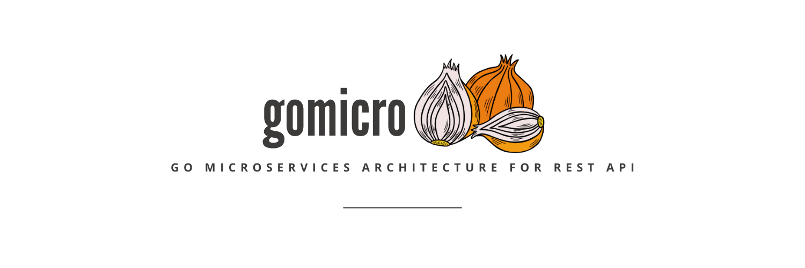
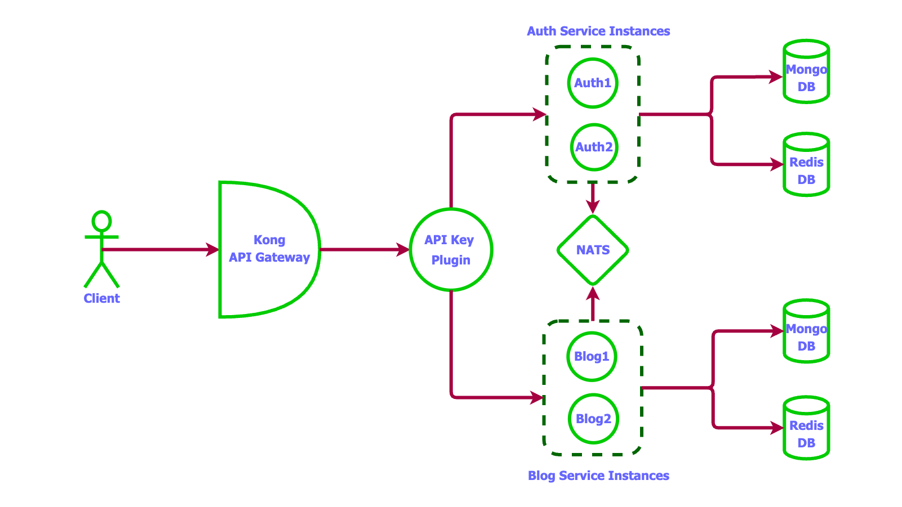

# gomicro - Go Microservices Architecture



## Create Blogging Platform Microservices
This project creates a blogging API service using [goserve](https://github.com/unusualcodeorg/goserve) micro framework. In this project Kong is used as the API gateway and NATS for the interservice communication. Each service has its own Mongo database and Redis database (Note: a single mongo and redis server is used for multiple databases).

This project breaks down the monolithic go blog backend project provided at [goserve](https://github.com/unusualcodeorg/goserve) repository. It uses the [goserve](https://github.com/unusualcodeorg/goserve) REST API framework to build the auth_service, and blog_service.

## Highlights
- goserve micro architecture
- kong API gateway
- nats for microservices communication
- custom kong go plugin for apikey validation
- docker and docker-compose
- mongo
- redis

> More details on the REST part can be found at [goserve](https://github.com/unusualcodeorg/goserve) github repo

# Project Directories
1. **kong**: kong configuration and plugins
2. **auth_service**: auth APIs code 
3. **blog_service**: blog APIs code 

**Helper/Optional Directories**
1. **.extra**: mongo script for initialization inside docker, other web assets and documents
2. **.tools**: RSA key generator, and .env copier
3. **.vscode**: editor config and service debug launch settings

# Microservice System Design

**Request Flow**
- client request comes to kong 
- `apikey-auth-plugin` calls `http://auth:8000/verify/apikey` within docker network
- successful request is forwarded to the respective service
- service returns with the appropriate response to kong
- kong sends the response back to the client

**Authentication**
- users collection exists in the auth_service database
- auth_service has logic to validate the JWT access token
- auth_service validates the token using a middleware
- blog_service asks auth_service to validate the token via nats messaging

**Authorization**
- users and roles collection exists in the auth_service database
- auth_service checks the roles based on the asked role code
- auth_service validates the role using a middleware
- blog_service asks auth_service to validate a user's role via nats messaging

> This Authentication and Authorization implementation gives freedom to individual services to decide on the public, protected, and restricted APIs on its own.

## The project runs in 2 configurations

**1. Without Load Balancing**


**2. With Load Balancing**


# Installation Instructions
vscode is the recommended editor - dark theme 

**1. Get the repo**

```bash
git clone https://github.com/unusualcodeorg/gomicro.git
```

**2. Generate RSA Keys**
```
go run .tools/rsa/keygen.go
```

**3. Create .env files**
```
go run .tools/copy/envs.go 
```

**4. Run Docker Compose**
Install Docker and Docker Compose. [Find Instructions Here](https://docs.docker.com/install/).

> Without Load Balancing
```bash
docker-compose up --build
```
OR

> With Load Balancing
```bash
docker-compose -f docker-compose-load-balanced.yml up --build
```

You will be able to access the api from http://localhost:8000

> If having any issue make sure 8000 port is not occupied

## API DOC
[](https://documenter.getpostman.com/view/1552895/2sA3dxCWsa)

# Read the Articles to understand this project
[How to Architect Good Go Backend REST API Services](https://medium.com/@janishar.ali/how-to-architecture-good-go-backend-rest-api-services-14cc4730c05b)

# Documentation
Information about the framework
> API framework details can be found at [goserve](https://github.com/unusualcodeorg/goserve) github repo

## NATS
To communicate among services through nats a message struct is required

```go
package message

type SampleMessage struct {
  Field1 string `json:"field1,omitempty"`
  Field2 string `json:"field2,omitempty"`
}

func EmptySampleMessage() *SampleMessage {
  return &SampleMessage{}
}

func NewSampleMessage(f1, f2 string) *SampleMessage {
  return &SampleMessage{
    Field1: f1,
    Field2: f2,
  }
}
```

## Controller
- It implements `micro.Controller` from `github.com/unusualcodeorg/goserve/arch/micro`
- `MountNats` is used to mount the endpoints that other services can call through nats 
- `MountRoutes` is used to mount the endpoints for http clients

```go
package sample

import (
  "fmt"
  "github.com/gin-gonic/gin"
  "github.com/unusualcodeorg/gomicro/microservice2/api/sample/message"
  "github.com/unusualcodeorg/goserve/arch/micro"
  "github.com/unusualcodeorg/goserve/arch/network"
)

type controller struct {
  micro.BaseController
  service Service
}

func NewController(
  authMFunc network.AuthenticationProvider,
  authorizeMFunc network.AuthorizationProvider,
  service Service,
) micro.Controller {
  return &controller{
    BaseController: micro.NewBaseController("/sample", authMFunc, authorizeMFunc),
    service:        service,
  }
}

func (c *controller) MountNats(group micro.NatsGroup) {
  group.AddEndpoint("ping", micro.NatsHandlerFunc(c.pingHandler))
}

func (c *controller) MountRoutes(group *gin.RouterGroup) {
  group.GET("/ping", c.getEchoHandler)
  group.GET("/service/ping", c.getServicePingHandler)
}

func (c *controller) pingHandler(req micro.NatsRequest) {
  fmt.Println(string(req.Data()))
  msg := message.NewSampleMessage("from", "microservice2")
  c.SendNats(req).Message(msg)
}

func (c *controller) getEchoHandler(ctx *gin.Context) {
  c.Send(ctx).SuccessMsgResponse("pong!")
}

func (c *controller) getServicePingHandler(ctx *gin.Context) {
  msg := message.NewSampleMessage("from", "microservice2")
  received, err := c.service.GetSampleMessage(msg)
  if err != nil {
    c.Send(ctx).MixedError(err)
    return
  }
  c.Send(ctx).SuccessDataResponse("success", received)
}

```

## Service
- `micro.RequestBuilder[message.SampleMessage]` is used to call other services to get `SampleMessage` through nats

```go
package sample

import (
  "github.com/unusualcodeorg/gomicro/microservice2/api/sample/dto"
  "github.com/unusualcodeorg/gomicro/microservice2/api/sample/message"
  "github.com/unusualcodeorg/gomicro/microservice2/api/sample/model"
  "github.com/unusualcodeorg/goserve/arch/micro"
  "github.com/unusualcodeorg/goserve/arch/mongo"
  "github.com/unusualcodeorg/goserve/arch/network"
  "github.com/unusualcodeorg/goserve/arch/redis"
  "go.mongodb.org/mongo-driver/bson"
  "go.mongodb.org/mongo-driver/bson/primitive"
)

type Service interface {
  FindSample(id primitive.ObjectID) (*model.Sample, error)
  GetSampleMessage(data *message.SampleMessage) (*message.SampleMessage, error)
}

type service struct {
  network.BaseService
  sampleQueryBuilder   mongo.QueryBuilder[model.Sample]
  infoSampleCache      redis.Cache[dto.InfoSample]
  sampleRequestBuilder micro.RequestBuilder[message.SampleMessage]
}

func NewService(db mongo.Database, store redis.Store, natsClient micro.NatsClient) Service {
  return &service{
    BaseService:          network.NewBaseService(),
    sampleQueryBuilder:   mongo.NewQueryBuilder[model.Sample](db, model.CollectionName),
    infoSampleCache:      redis.NewCache[dto.InfoSample](store),
    sampleRequestBuilder: micro.NewRequestBuilder[message.SampleMessage](natsClient, "microservice1.sample.ping"),
  }
}

func (s *service) GetSampleMessage(data *message.SampleMessage) (*message.SampleMessage, error) {
  return s.sampleRequestBuilder.Request(data).Nats()
}

func (s *service) FindSample(id primitive.ObjectID) (*model.Sample, error) {
  filter := bson.M{"_id": id}

  msg, err := s.sampleQueryBuilder.SingleQuery().FindOne(filter, nil)
  if err != nil {
    return nil, err
  }

  return msg, nil
}

```

## NatsClient
NatsClient should be created to connect and talk to nats
```go
  natsConfig := micro.Config{
    NatsUrl:            env.NatsUrl,
    NatsServiceName:    env.NatsServiceName,
    NatsServiceVersion: env.NatsServiceVersion,
    Timeout:            time.Second * 10,
  }

  natsClient := micro.NewNatsClient(&natsConfig)
```
> More details on nats can be found at [nats-io/nats.go](https://github.com/nats-io/nats.go/blob/main/micro/README.md). goserve creates a simple wrapper over this library.

### If you are coming from [goserve](https://github.com/unusualcodeorg/goserve) framework for monolithic go architecture
- `micro.Module[module]` should used for instance creation in place of `network.Module[module]`
- `micro.NewRouter` should be used in place of `network.NewRouter`
- `micro.NewRouter` should be used in place of `network.NewRouter`
- `micro.BaseController` should be used in place of `network.BaseController`
- `micro.Controller` should be used in place of `network.Controller`

## Find this project useful ? :heart:
* Support it by clicking the :star: button on the upper right of this page. :v:

## More on YouTube channel - Unusual Code
Subscribe to the YouTube channel `UnusualCode` for understanding the concepts used in this project:

[](https://www.youtube.com/@unusualcode)

## Contribution
Please feel free to fork it and open a PR.